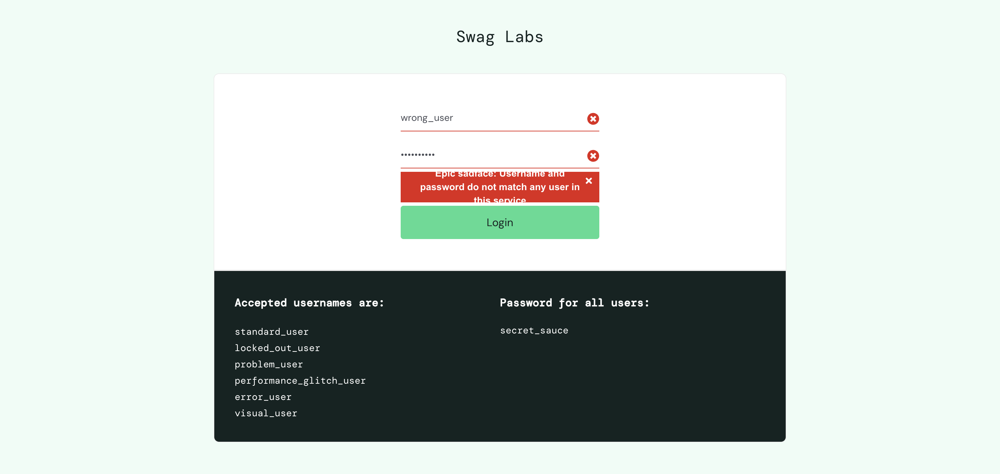
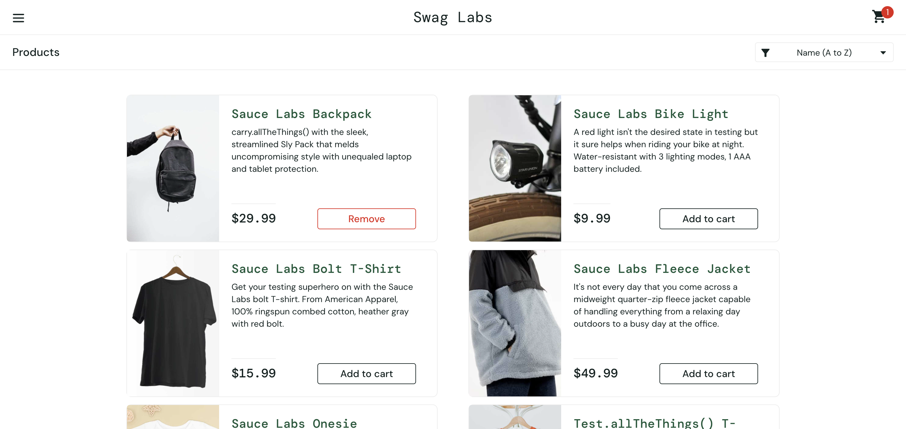

# 🛒 E-commerce Test Automation Framework

A comprehensive test automation framework built with Selenium, Pytest, and Allure for testing e-commerce applications. This framework demonstrates modern test automation practices with UI testing, API testing, and CI/CD integration.


## 📋 Table of Contents

- [Overview](#overview)
- [Features](#features)
- [Project Structure](#project-structure)
- [Test Coverage](#test-coverage)
- [Installation](#installation)
- [Usage](#usage)
- [CI/CD Pipeline](#cicd-pipeline)
- [Test Reports](#test-reports)
- [Screenshots](#screenshots)
- [Contributing](#contributing)

## 🎯 Overview

This framework provides a robust foundation for automated testing of e-commerce applications. It includes:

- **UI Automation**: Complete user journey testing (login, shopping cart, checkout)
- **API Testing**: REST API validation and data operations
- **Page Object Model**: Maintainable and reusable test code
- **Allure Reporting**: Detailed test reports with screenshots and logs
- **CI/CD Integration**: Automated testing with GitHub Actions

## ✨ Features

### 🖥️ UI Testing
- **Login Functionality**: Valid and invalid user authentication
- **Shopping Cart**: Add/remove items, cart validation
- **Checkout Process**: Complete purchase flow with form validation
- **Cross-browser Support**: Chrome WebDriver with automatic management

### 🔌 API Testing
- **REST API Validation**: GET, POST, DELETE operations
- **Data Integrity**: Response validation and error handling
- **Integration Testing**: API and UI test coordination

### 📊 Reporting & Analytics
- **Allure Reports**: Interactive HTML reports with screenshots
- **Test Metrics**: Pass/fail rates, execution times
- **Screenshot Capture**: Automatic screenshots on test failures
- **Logging**: Detailed browser and test execution logs

### 🔄 CI/CD Integration
- **GitHub Actions**: Automated testing on push/PR
- **Artifact Management**: Test results and reports storage
- **Cross-platform**: Runs on Ubuntu, macOS, Windows

## 📁 Project Structure

```
ecommerce-test-framework/
├── 📁 tests/                    # UI automation tests
│   ├── test_login.py           # Login functionality tests
│   ├── test_add_to_cart.py     # Shopping cart tests
│   └── test_checkout.py        # Checkout flow tests
├── 📁 api_tests/               # API testing
│   └── test_api_users.py       # REST API tests
├── 📁 page_objects/            # Page Object Model
│   ├── login_page.py           # Login page interactions
│   ├── products_page.py        # Product catalog operations
│   └── checkout_page.py        # Checkout process
├── 📁 .github/workflows/       # CI/CD configuration
│   └── tests.yml               # GitHub Actions workflow
├── 📁 allure-results/          # Test execution results
├── conftest.py                 # Pytest configuration & fixtures
├── requirements.txt             # Python dependencies
└── README.md                   # Project documentation
```

## 🧪 Test Coverage

### UI Test Scenarios
| Test Case | Description | Status |
|-----------|-------------|--------|
| Valid Login | Successful authentication with correct credentials | ✅ |
| Invalid Login | Error handling for wrong credentials | ✅ |
| Add to Cart | Add products to shopping cart | ✅ |
| Checkout Flow | Complete purchase process | ✅ |

### API Test Scenarios
| Test Case | Description | Status |
|-----------|-------------|--------|
| GET Posts | Retrieve data from API | ✅ |
| CREATE Post | Add new data via API | ✅ |
| DELETE Post | Remove data via API | ✅ |

## 🚀 Installation

### Prerequisites
- Python 3.12+
- Google Chrome browser
- Git

### Setup Instructions

1. **Clone the repository**
   ```bash
   git clone https://github.com/nirali112/ecommerce-test-framework.git
   cd ecommerce-test-framework
   ```

2. **Create virtual environment**
   ```bash
   python -m venv venv
   source venv/bin/activate  # On Windows: venv\Scripts\activate
   ```

3. **Install dependencies**
   ```bash
   pip install -r requirements.txt
   ```

4. **Verify installation**
   ```bash
   python -m pytest --version
   ```

## 🎮 Usage

### Running Tests Locally

**Run all tests:**
```bash
python -m pytest tests/ api_tests/ -v
```

**Run specific test categories:**
```bash
# UI tests only
python -m pytest tests/ -v

# API tests only
python -m pytest api_tests/ -v

# Specific test file
python -m pytest tests/test_login.py -v
```

**Run with Allure reporting:**
```bash
python -m pytest tests/ api_tests/ --alluredir=./allure-results
allure serve allure-results
```

### Test Execution Examples

```bash
# Run login tests with detailed output
python -m pytest tests/test_login.py::TestLogin::test_valid_login -v -s

# Run checkout flow test
python -m pytest tests/test_checkout.py::TestCheckout::test_checkout_flow -v

# Run API tests
python -m pytest api_tests/test_api_users.py -v
```

## 🔄 CI/CD Pipeline

The framework includes a GitHub Actions workflow that:

- **Triggers**: On push to main branch and pull requests
- **Environment**: Ubuntu 24.04 with Python 3.12
- **Browser**: Google Chrome with automatic WebDriver management
- **Reports**: Allure reports generated and uploaded as artifacts

### Workflow Steps
1. **Setup**: Python environment and dependencies
2. **Browser Setup**: Chrome installation and WebDriver configuration
3. **Test Execution**: UI and API tests with Allure results
4. **Report Generation**: Allure HTML reports
5. **Artifact Upload**: Test results and reports storage

## 📊 Test Reports

### Allure Reports
- **Interactive HTML reports** with detailed test information
- **Screenshots** automatically captured on test failures
- **Browser logs** and page source for debugging
- **Test metrics** and execution statistics

### Accessing Reports
1. Go to GitHub Actions tab
2. Click on latest workflow run
3. Download `allure-report` artifact
4. Open `index.html` in browser

## 📸 Screenshots

### Test Execution Screenshots

| Screenshot | Description |
|------------|-------------|
|  | Successful login test execution |
|  | Complete checkout process test |

### Additional Screenshots to Add

**Recommended screenshots for GitHub:**

1. **Project Overview Screenshot**
   - Terminal showing test execution
   - Allure report dashboard
   - GitHub Actions workflow status

2. **Test Results Screenshot**
   - Pytest execution output
   - Allure report interface
   - Test coverage summary

3. **CI/CD Pipeline Screenshot**
   - GitHub Actions workflow run
   - Artifacts section
   - Test summary

4. **Framework Architecture Screenshot**
   - Project structure visualization
   - Page Object Model diagram
   - Test flow diagram

## 🛠️ Technology Stack

| Component | Technology | Version |
|-----------|------------|---------|
| **Test Framework** | Pytest | 8.2.0 |
| **UI Automation** | Selenium WebDriver | 4.20.0 |
| **Browser Management** | WebDriver Manager | 4.0.2 |
| **Reporting** | Allure Pytest | 2.13.5 |
| **API Testing** | Requests | 2.32.0 |
| **CI/CD** | GitHub Actions | Latest |
| **Language** | Python | 3.12 |

## 🎯 Best Practices Implemented

- **Page Object Model**: Maintainable and reusable test code
- **Explicit Waits**: Reliable element interactions
- **Error Handling**: Comprehensive exception management
- **Screenshot Capture**: Automatic failure documentation
- **Parallel Execution**: Scalable test execution
- **Cross-platform**: Works on multiple operating systems

## 🤝 Contributing

1. Fork the repository
2. Create a feature branch (`git checkout -b feature/amazing-feature`)
3. Commit your changes (`git commit -m 'Add amazing feature'`)
4. Push to the branch (`git push origin feature/amazing-feature`)
5. Open a Pull Request

### Development Guidelines
- Follow PEP 8 coding standards
- Add tests for new features
- Update documentation as needed
- Ensure all tests pass before submitting PR

## 📝 License

This project is licensed under the MIT License - see the [LICENSE](LICENSE) file for details.

## 🙏 Acknowledgments

- [Sauce Demo](https://www.saucedemo.com/) - Test application
- [Selenium](https://selenium.dev/) - Web automation
- [Pytest](https://pytest.org/) - Testing framework
- [Allure](https://allure.qameta.io/) - Test reporting

---

🔗 **Connect with me**: [GitHub Profile](https://github.com/nirali112)
